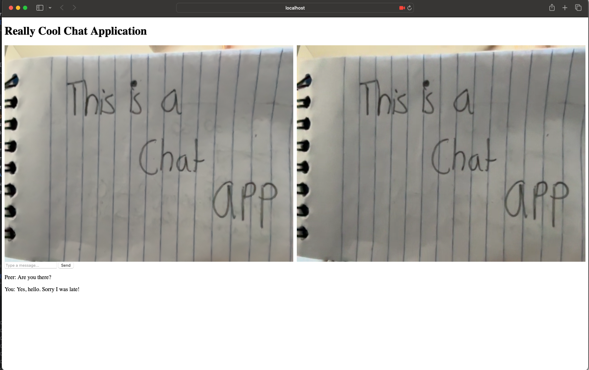

# WebRTC Video Chat
Simple Video Chat Application Using WebRTC (Web Real-Time Communication). WebRTC allows browsers and mobile applications to communicate with one another in real time. 
There are many underlying problems related to video and audio transmission, such as bandwidth adaptivity, noise reduction and suppression, and packet-loss concealment to
name a few. WebRTC handles all of these issues under the hood, making it a great choice for real-time communications.


## How to Run:
Clone the project, and run the following commands in the terminal from the root:
```
mvnw spring-boot:run
cd src/main/resources/static
open index.html
```
Copy the address of the index.html file in your browser and paste it into another tab or another browser to simulate the remote peer.

***Note:*** The backend for this project runs on localhost. The default port is 8080, but you can change the port by changing the port number in the `server.port` field in `src/main/resources/application.properties` file.

## Java/Spring Backend:
The Java/Spring Boot backend creates a signaling server by utilizing spring boots websocket starter framework. We register a socket handler at path */socket* that uses a
SocketHandler (class we defined, not the one provided by java logging) to handle incoming messages. Peers that have established a connection with our signaling server can 
send messages in the form of offer, answer, and candidate messages. The Java/Spring Boot backend then handles these messages and sends them to the other peer. **Code can be
found in src/main/resources/static**.

### Offer:
An offer is a message that contains an offer to connect to the other peer. The offer contains the following:
- sdp: the session description protocol
- type: the type of the offer

### Answer:
An answer is a message that contains an answer to an offer. The answer contains the following:
- sdp: the session description protocol
- type: the type of the answer

### Candidate:
A candidate is a message that contains a new candidate. The candidate is essential for establishing the connection between two peers, it provides information about potential
network paths that can be used to connect the peers. The candidate contains the following:
- sdp: the session description protocol     
- type: the type of the candidate

## JavaScript Frontend:
The JavaScript frontend sets up a basic WebRTC connection for P2P video chat between two users. It uses our backend WebSocket server as a signaling server to exchange
connection offers, answers and ICE candidates between the peers.

### index.html
A simple HTML file with some basic CSS to display the video streams from the local and remote peers. Calls the `client.js` script after the local and remote video elements have been defined.

### Client.js
1. **Establishes a connection to our WebSocket signaling server**: The server helps exchange connection information between peers.
2. **Accesses Local Media**: Requests access to the user's camera and microphone via the getUserMedia API. The local video feed is set to a `<video>` element.
3. **Creates a PeerConnection**: Creates a new RTCPeerConnection objet to handle the WebRTC connection. The peer connection is responsible for managing media streams and network traversal through ICE elements.
4. **Handle Tracks**: When a remote track (audio/video stream) is received, it is assigned to the remote video element to display the video from the other peer. ***Note***: we can only handle single connections at the moment. We will add support for multiple connections in the future.
5. **Exchanges ICE Candidates**: Handles ICE (Interactive Connection Establishment) Candidates, which are needed to establish and maintain a stable P2P connection through Network Address Traversal (NAT).
6. **Manages SDP Offers and Answers**: When a peer connection is initiated, the script creates an SDP (Session Description Protocol) offer and sends it to the other peer. Upon receiving that offer from a peer, it creates an SDP answer in response. Both offer and answer contain the media and connection details required for a P2P connection.
7. **Handle WebSocket Events**: 
   1. `onmessage`: When the script receives a message from the signaling server, it processes based on its type (offer, answer or candidate). This helps establish or update the P2P connection.
   2. `onopen`: Triggered when the WebSocket connection is successfully established. In this case, the script sends an offer to the other peer.
   3. `onclose`: Handles the event when the WebSocket connection is closed.
   4. `onerror`: Handles any errors that occur in the WebSocket connection.

# Future Improvements:
- Host elsewhere, currently just a local MVP.
- Add support for multiple connections
- Stop displaying video after remote or local peer disconnects (currently displays a still image after the video stream ends)

#### This was created as a response to John Crickett's coding challenge #76 on 10/26/2024. For more info, see [John's Challenge](https://codingchallenges.substack.com/p/coding-challenge-76-build-your-own).